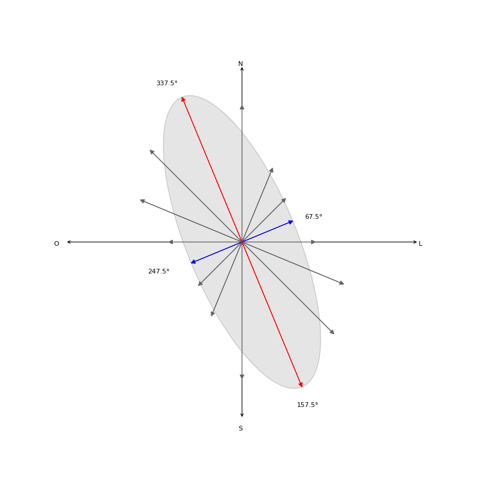

# Project: Rose Diagram

This is a simple project to generate a Rose Diagram with the principal directions of the Walker Lake sample dataset (ISAAKS; SRIVASTAVA, 1989, p. 153).




## Installation

To install this repository there are two ways:
- Download the repository ZIP file and unpack it inside the vagrant directory of the virtual machine.
- Or clone the repository

```sh
$ $ git clone https://github.com/rccmodena/rose_diagram.git
$ cd rose_diagram/
```

## Requirements

This project was implemented in a **Jupyter Notebook** with **Python 3.7.16**.

The Python Standard Libraries used:
- [math](https://docs.python.org/3/library/math.html#module-math)

Other Libraries used:
- [matplotlib - 3.0.3](https://matplotlib.org/index.html)
- [numpy - 1.16-2](https://www.numpy.org)

## TODO

- Refactor the code to:
  - enhance the performance;
  - best practices;
  - follow the PEP 8;
- Create a version importing from a text file the principal directions of anisotropy;
- Create a python script to access outside the Jupyter Notebook;
- May create a web interface for the script.


## How to Contribute

If you find any bug or have a suggestion for another resources, feel free to improve this project.

First, you have to fork this repository.

Next, clone this repository to your computer to make the changes.

Once you've pushed changes to your local repository, you can issue a pull request.

## License

The contents of this repository are covered under the [MIT License](LICENSE).
